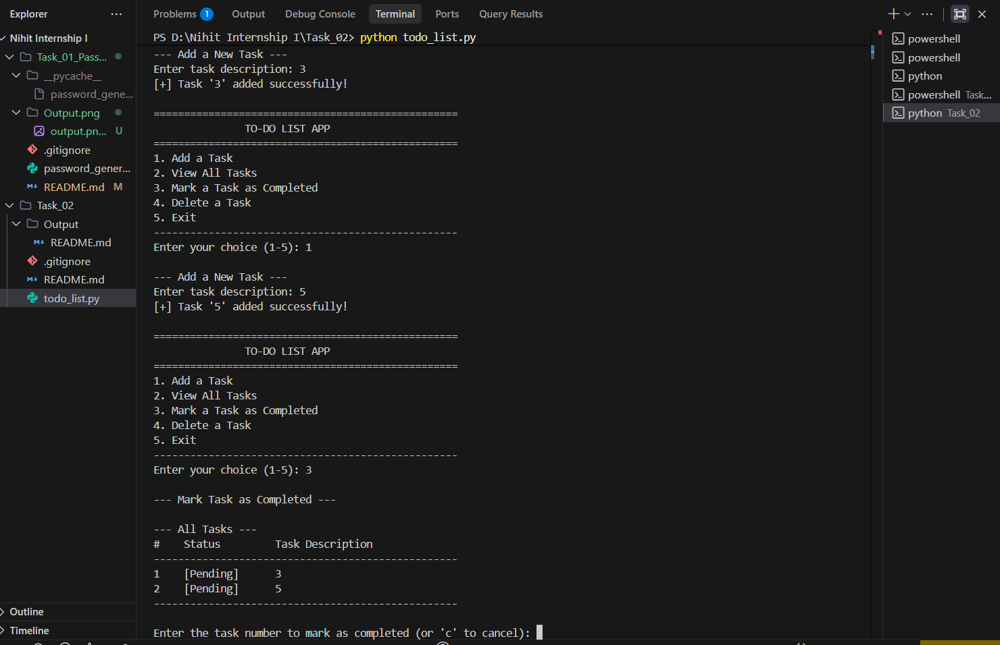

# IncodeVision Python Internship
## Task 02: Console-Based To-Do List Application

An interactive, user-friendly command-line To-Do List application developed in Python for the **IncodeVision Python Internship**. This project helps users manage daily tasks effectively by adding, tracking, completing, and deleting tasks through a clean menu-driven interface.

---

## 📌 Project Overview

Task management is a fundamental productivity requirement. This project delivers a lightweight, menu-driven Python console application that enables seamless task management during runtime. The tasks are stored dynamically in Python data structures with clear status tracking (`[Pending]` vs. `[Completed]`).

---

## ✨ Features

- **➕ Add Tasks**: Quickly add new tasks with descriptive text (empty inputs are guarded against).
- **📋 View Tasks**: Displays all current tasks in a formatted table layout with index numbers and status indicators (`[Pending]` / `[Completed]`).
- **✅ Mark as Completed**: Toggle task status from `[Pending]` to `[Completed]` with numeric selection.
- **🗑️ Delete Tasks**: Remove unwanted or completed tasks safely using their list index.
- **🛡️ Robust Input Handling**: Gracefully handles non-numeric inputs, out-of-range options, empty descriptions, and cancellation without crashing.
- **📦 Zero External Dependencies**: Built entirely with Python's standard library.

---

## 🛠️ Technologies Used

- **Language**: Python 3.8+
- **Core Concepts**:
  - Python Lists & Dictionaries for in-memory data structures
  - Exception Handling (`try...except`) for crash-proof input validation
  - Modular functions with descriptive docstrings

---

## 🚀 How to Run the Project

### 1. Prerequisites
Verify that Python 3 is installed:
```bash
python --version
```

### 2. Navigate to Task 2 Directory
```bash
cd Task_02
```

### 3. Run the Application
```bash
python todo_list.py
```

---

## 💡 Example Usage

```text
==================================================
               TO-DO LIST APP               
==================================================
1. Add a Task
2. View All Tasks
3. Mark a Task as Completed
4. Delete a Task
5. Exit
--------------------------------------------------
Enter your choice (1-5): 1

--- Add a New Task ---
Enter task description: Finish Python Task 02
[+] Task 'Finish Python Task 02' added successfully!

Enter your choice (1-5): 2

--- All Tasks ---
#    Status         Task Description
--------------------------------------------------
1    [Pending]      Finish Python Task 02
--------------------------------------------------

Enter your choice (1-5): 3

--- Mark Task as Completed ---
Enter the task number to mark as completed (or 'c' to cancel): 1
[+] Task #1 'Finish Python Task 02' marked as Completed!
```

---

## Output Screenshot



---

## 📂 Project Structure

```text
Task_02/
├── Output/
│   └── Output.png          # Output execution screenshot
├── todo_list.py            # Main application source code
├── README.md               # Project documentation
└── .gitignore              # Ignores bytecode and temporary cache files
```

---

## 🏢 Internship & Company Information

- **Company / Organization**: IncodeVision
- **Role / Track**: Python Development Intern
- **Task**: Task 02 – Console-Based To-Do List Application
- **Developer**: Nihit Choudhary
- **Repository**: [Incodevision_Python_Internship_Task_2](https://github.com/nihitchoudhary690-sys/Incodevision_Python_Internship_Task_2.git)
